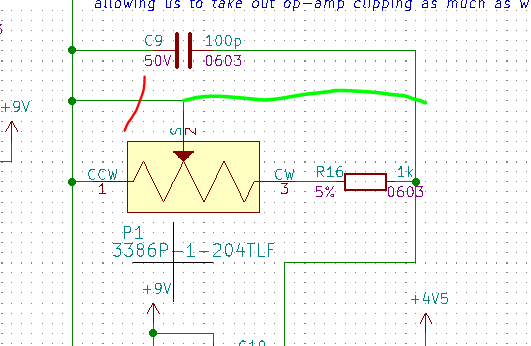
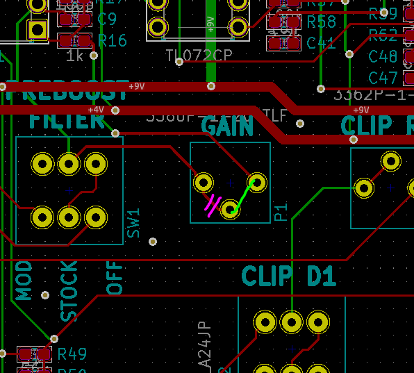

# Graduator

A bass fuzz for my good friend! Don't tell him, it's a surprise. Starting with a Boss MT-2 (I know, ew, don't tell anybody) because that's allegedly how Arion Salazar got most of his fuzz tone's on Third Eye Blind's self-titled (check out 2:20-2:30 in Graduate, of 4:10 in Thanks a Lot if you like yours with phaser). Hell yeah we want that, don't pretend you don't like that record. 

Adding the popular mods as options, retuning most of the gyrator filters down a bit, adding trim pots for some of the key filters and gains, and doing a non-form-factor layout so I can get all my dumb bugs out of my system before it's annoying to rework.

Form factor by May lol!

Formerly "yellow fuzz" after BRC's "yellow bikes" that happen to be green. Didn't like the sound of it, now it's the Graduator.

## Mods Planned

| Change | Goal | Done |
| ------ | ---- | ---- |
| Make gyrators after clipping stage optional (see C24/C25, C20/C17) | Experiment with pedal character to reduce fizz and deliver more even tone to the eq section so I can hear the difference. | Yes |
| Add bypass option for preboost stage. | Try to reduce fizz. | Yes |
| Add series variable resistors (trim pots) to clipping diodes D3/D4. | Try to reduce fizz. | Yes |
| Add selector switch for 3 different diode options in each direction. | Experiment with higher Vf (LEDs) and give germanium a whirl. | Yes |

## Parts Needed 

### For Form-Factor Version
* 1/4" Stereo Jack, Panel Mount with header footprint.
* 1/4" Mono Jack, Panel Mount with header footprint
* Re-evaluate all potentiometer tapers and footprints.

## Issues

| Issue | Workaround | Fix | Fixed in Master |
| ----- | ---------- | --- | --------------- |
| C2 and R6 ref desisators are swapped. HTML BOM shows correct outlines. | Install per HTML BOM. | Swap ref des back. | |
| R4, R6-7, R12, R14-15, R17-18, R24-26, R33, R51 MPN is for 1k part, should be 10k (part description on BOM is correct, but MPN is wrong). | Install 10k part. | Update component in lib. | | 
| R14 and R15 ref des are colliding. | N/A | Fix in layout. | |
| NSVJ3910SB3T1G was replaced in order with J113, which is a through-hole part and won't fit. | Order correct part. | Make sure MPN in design is correct and orderable. | |
| PTV111-4420-A104 was missing from kit, got extra PTV112-4420-A104 instead. | Cut leads 1 and 2, bend 3-6 down to fit into pads 1-4 to use just one pot of the two in the package. | Order the right thing. | |
| PTV111-4420-A503 was missing from kit, got extra PTV112-4420-A503 instead. | Cut leads 1 and 2, bend 3-6 down to fit into pads 1-4 to use just one pot of the two in the package. | Order the right thing. | |
| Nichicon UST1H010MDD1TE footprint is wrong (C1, C19, C26, C36, C43, C46): lead spacing is nto correct, part leads are flared for wider spacing than footprint. | Bend leads back. | Correct footprint. | | 
| D6 missing MPN info. | N/A | Correct part library ref. | |
| No test points, doh. | N/A | Add some ground test points and stage-to-stage test points and jumpers. | |
| Used center-positive jack, which might be a problem for a standard pedal board. | Use as center-positive. | Research and consider switching to center-negative. |  |
| 22 Ohm series-R on power rail, why even would you do that? | Short that. | Remove that. | |
| Polarity marks on op-amps are not visible enough, and are obscured when sockets are installed (U1 was installed rotated 180 degrees in first build). | Note polarity carefully during build. | Improve op amp polarity marks. | |
| Pre-distortion boost gain pot P1 is backwards (CCW for more) | Turn it the other way, or snip top-side trace between pins 1-2, short pins 1-3.   | Correct in schematic. | |

## References

### Other Pedals I'm eyeing
* DOD FX91 Bass Overdrive
* Darkglass - Duality
* Zvex - Wooly Mammoth
* Death by Audio - Fuzz War
* Bass Big Muff
* MXR Bass Fuzz
* Fairfield Barbershop
